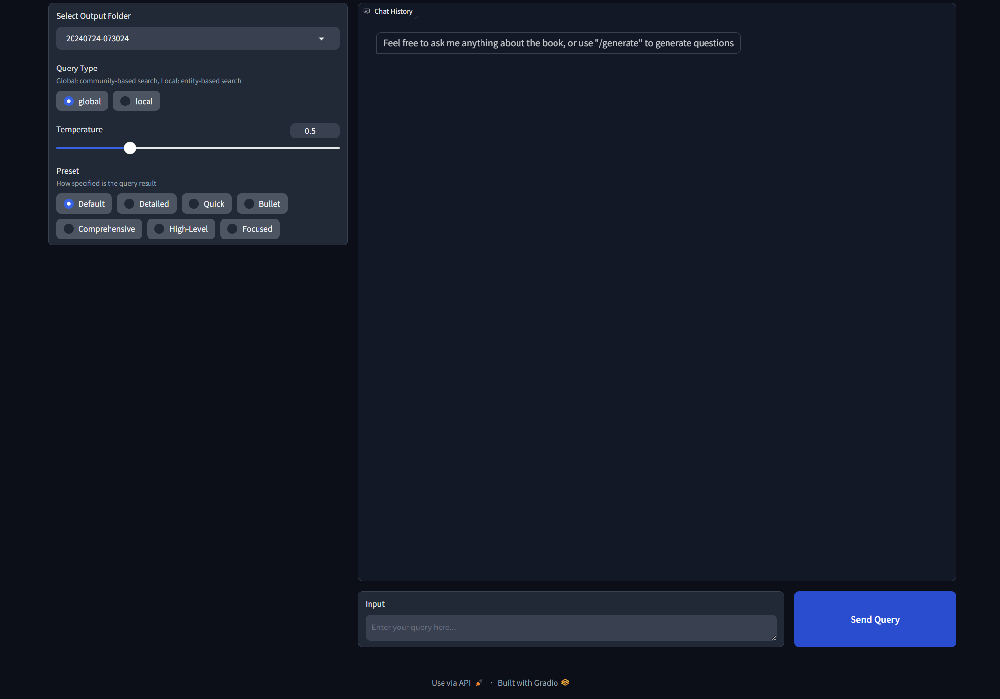

# Guide to build graphrag with local LLM
This repo is my settings for using the local LLM with graphrag, also comes with a convenient UI, **this repo is still experimental, 
so any config here is subject to change**



## Environment
I'm using Ollama (~~llama3~~ llama3.1) on Windows and ~~LM Studio (nomic-text-embed)~~ Ollama (nomic-text-embed) for text embeddings

Please don't use WSL if you use LM studio for embeddings because it will have issues connecting to the services on Windows (LM studio)

### IMPORTANT! Fix your model context length in Ollama

Ollama's default context length is 2048, which might truncate the input and output when indexing

I'm using 12k context here (10*1024=12288), I tried using 10k before, but the results still gets truncated

**Input / Output truncated might get you a completely out of context report in local search!!**

Note that if you change the model in `setttings.yaml` and try to reindex, it will restart the whole indexing!

First, pull the models we need to use

```
ollama serve
# in another terminal
ollama pull llama3.1
ollama pull nomic-embed-text
```

Then build the model with the `Modelfile` in this repo
```
ollama create llama3.1-12k -f ./Modelfile
```

## Steps for GraphRAG Indexing
First, activate the conda enviroment
```
conda create -n rag python=<any version below 3.12>
conda activate rag
```

Clone this project then cd the directory
```
git clone https://github.com/wenwkich/graphrag-ollama-config.git
cd graphrag-ollama-config
```

Then pull the code of graphrag (I'm using a local fix for graphrag here) and install the package 
```
git clone https://github.com/wenwkich/graphrag-ollama.git
pip install -e ./graphrag
```

You can skip this step if you used this repo, but this is for initializing the graphrag folder
```
python -m graphrag.index --init --root .
```

Create your `.env` file
```
cp .env.example .env
```

Move your input text to `./input/`

Double check the parameters in `.env` and `settings.yaml`, make sure in `setting.yaml`, 
it should be "community_reports" instead of "community_report"

Then finetune the prompts (this is important, this will generate a much better result)
```
python -m graphrag.prompt_tune --root . --no-entity-types
```

Then you can start the indexing
```
python -m graphrag.index --root .
```

You can check the logs in `./output/<timestamp>/reports/indexing-engine.log` for errors

Test a global query
```
python -m graphrag.query \
--root . \
--method global \
"What are the top themes in this story?"
```

## Using the UI

First, make sure requirements are installed
```
pip install -r requirements.txt
```

Then run the app using 
```
gradio app.py
```

To use the app, visit http://127.0.0.1:7860/

Make sure you select the valid output folder before you query

Note that "/generate" will disregard the query type and generate questions with a local search

### Known bug

* "/generate" is not usable at the moment

## Troubleshooting

### "Columns must be same length as key"

This is usually API issue, check your `settings.yaml` if the `api_base` and `model` under `llm` is correct

### "Failed to generate valid JSON output" 

This is due to a function `is_response_valid` in the code, in most scenerio the json is actually valid, 
but was rejected by this function for some reason

Fix line 67 in the file `graphrag\llm\openai\openai_chat_llm.py`

```python
        # is_response_valid = kwargs.get("is_response_valid") or (lambda _x: True)
        is_response_valid = lambda _x: True
```

Restart the indexing and you will find out it will start from the last checkpoint

### JSON output for community report get truncated, getting JSONDecodeError

This is most likely because ollama's context window is set to 2048 by default, 
check `ollama show llama3.1 --parameters`, the output doesn't include `num_ctx`,
then it's the default value 2048, so the json output will get truncated

To fix it, normally needs to use ollama's api and add `num_ctx` options to it

Now Ollama's OpenAI compatible API doens't support this config, we have to hack into the model

Please refer to the [Environment](#IMPORTANT-Fix-your-model-context-length-in-Ollama) section to see how to fix the problem

### Embedding problems ("ZeroDivisionError: Weights sum to zero")

Use a local fix [repo](https://github.com/wenwkich/graphrag-ollama) will help [](#Steps-for-GraphRAG-Indexing)